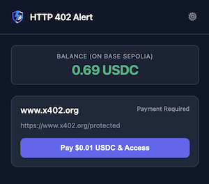

# HTTP 402 Alert Chrome Extension

A proof of concept for a Chrome extension that implements a lightweight EVM wallet and allows payments whenever a **x402** HTTP status code is encountered during web browsing. Something like this could be used to create an on-demand payment wall for websites.

**Important**: This is a proof of concept and should not be used for any production purposes or with real money. It is also not a complete implementation and may not work for all websites.

## Installation

1. Clone this repository
2. Run `npm install` to install dependencies
3. Run `npm run build` to build the extension
4. Open Chrome and navigate to `chrome://extensions/`
5. Enable "Developer mode" (toggle in top-right corner)
6. Click "Load unpacked"
7. Select the extension directory in `./build`
8. The extension icon should appear in your Chrome toolbar (you might want to pin it so it is always visible)

## Usage

1. Once installed, the extension automatically generates a new EVM private key. This can be viewed in the settings.
2. In order to pay for content, you need some Base Sepolia USDC. The extension provides a handy button in the settings to open a faucet.
3. Open an x402-enabled website. E.g. https://www.x402.org/protected
4. A red badge with "!" should appear next to the extension icon.
5. Click on it to open the extension popup, review the details, and pay for the content.
6. If all goes well, it should open the content in a new browser tab.

## Architecture / Data Flow

1. **Detection Phase** (`background.js`)
   - `chrome.webRequest.onHeadersReceived` listener catches 402 status codes
   - `extractPaymentInfo()` decodes the base64 `payment-required` header
   - Payment information stored in `chrome.storage.session` keyed by tabId
   - Extension badge updated with red "!" indicator

2. **Display Phase** (`popup.js`)
   - User clicks extension icon to open popup
   - `checkCurrentTabStatus()` retrieves payment info from session storage
   - `getDisplayInfo()` from `x402.js` formats payment details
   - Payment card rendered showing amount, network, and description

3. **Payment Phase** (`popup.js`, `x402.js`)
   - User confirms payment in modal
   - `executePayment()` creates EIP-712 signature using EthereumWallet
   - Builds payment payload with authorization and signature
   - Sends request to original URL with `PAYMENT-SIGNATURE` header
   - Receives protected content from server

4. **Content Display Phase** (`content-display.js`)
   - Content stored temporarily in session storage
   - New tab opened with `content-display.html?key=<timestamp>`
   - Content retrieved from storage and rendered
   - Storage cleaned up after display

## License

MIT License - Feel free to modify and distribute
